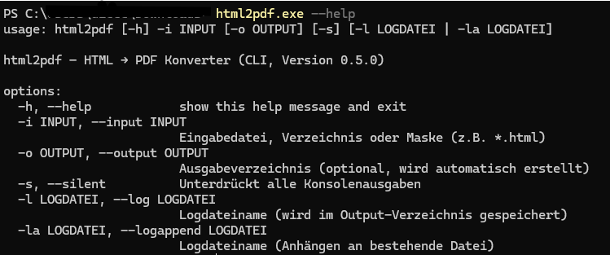
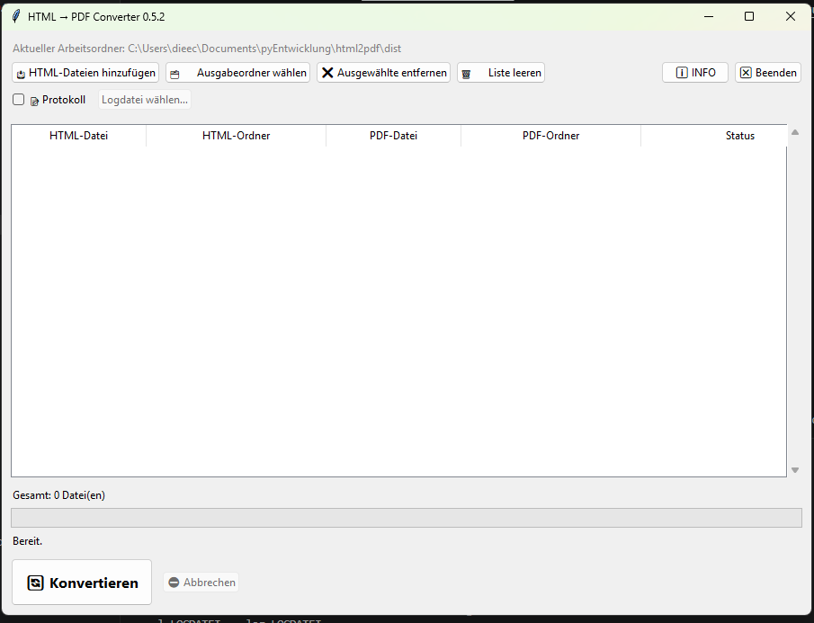

# 🟦 **HANDBUCH – html2pdf**

## 📑 **Inhaltsverzeichnis**

- [🟦 **HANDBUCH – html2pdf**](#-handbuch--html2pdf)
  - [📑 **Inhaltsverzeichnis**](#-inhaltsverzeichnis)
- [1. Einleitung](#1-einleitung)
  - [Zielgruppe:](#zielgruppe)
- [2. Installation \& Start](#2-installation--start)
  - [✨ Bezugsquelle](#-bezugsquelle)
  - [2.3 Programmstart](#23-programmstart)
- [3. Überblick über die Benutzeroberfläche (GUI)](#3-überblick-über-die-benutzeroberfläche-gui)
  - [Start der Anwendung](#start-der-anwendung)
  - [HTML‑Dateien hinzufügen](#htmldateien-hinzufügen)
  - [Ausgabeordner festlegen](#ausgabeordner-festlegen)
  - [Weitere Funktionen und Schalter](#weitere-funktionen-und-schalter)
  - [Konvertierung starten](#konvertierung-starten)
  - [Sitzung beenden](#sitzung-beenden)
- [Performance‑Hinweise](#performancehinweise)
- [Protokollierung](#protokollierung)
- [Kommandozeilen‑Modus (CLI)](#kommandozeilenmodus-cli)
  - [Parameterübersicht](#parameterübersicht)
  - [Beispiele](#beispiele)
  - [Silent‑Mode](#silentmode)
  - [Logging im CLI](#logging-im-cli)
- [Fehlerbehebung (Troubleshooting)](#fehlerbehebung-troubleshooting)
  - [Lizenztexte](#lizenztexte)
  - [12.4 Kontakt / Support](#124-kontakt--support)

---

# 1. Einleitung

**html2pdf** ist ein portables Werkzeug zur Konvertierung von HTML‑Dateien in PDF‑Dokumente.  
Es bietet:

- eine **moderne, reaktionsfähige GUI**  
- eine **vollwertige CLI**  
- eine **eingebettete portable wkhtmltopdf‑Engine**  
- keine Installation, keine Administratorrechte  

## Zielgruppe:
Anwender, die HTML‑Dateien schnell, zuverlässig und ohne Konfigurationsaufwand in PDF umwandeln möchten.

**Systemvoraussetzungen:**  
- Windows 10 oder neuer  
- Python 3.10+ (bei Nutzung aus dem Quellcode)  
- Keine Installation von wkhtmltopdf erforderlich. Eine installierte wkhtmltopdf-Version wird bevorzugt genutzt.

---

# 2. Installation & Start


## ✨ Bezugsquelle

Unter **[https://github.com/carosaar/html2pdf](https://github.com/carosaar/html2pdf) – Releases** steht eine sofort lauffähige Windows‑Version (`html2pdf.exe`) zur Verfügung.

Speichern Sie die erzeugte EXE in einem beliebigen Verzeichnis und ergänzen Sie diesen Speicherort in der **PATH‑Umgebungsvariable**, um die Anwendung bequem über die Kommandozeile starten zu können.

**Alternativ** kann das Repository auch selbst geklont werden:

```
git clone https://github.com/carosaar/html2pdf.git
```

Anschließend lässt sich die EXE gemäß den Hinweisen in der [README.md](../../../README.md) selbst erzeugen.  
Die Erstellung lauffähiger Versionen für andere Betriebssysteme wurde bislang weder vorbereitet noch getestet, sollte grundsätzlich aber möglich sein.

## 2.3 Programmstart

```bash
html2pdf
```
startet die grafische Oberfläche.

Das Programm kann jedoch auch auf der Kommandozeile der Konsole oder in batchprogrammen genutzt werden. Dazu werden die zu konvertierende/n Datei/n als Parameter übergeben. Dazu ist die Syntax zu beachten, die über `html2pdf --help` angezeigt wird:



---

# 3. Überblick über die Benutzeroberfläche (GUI)



## Start der Anwendung

Die GUI wird über die ausführbare Datei gestartet:

```
html2pdf.exe
```

Nach dem Start erscheint das Hauptfenster mit folgenden Bereichen:

- **Aktueller Arbeitsordner** (oben): zeigt das Verzeichnis, in dem die EXE ausgeführt wird  
- **Dateiliste** (Mitte): enthält alle HTML‑Dateien, die zur Konvertierung ausgewählt wurden  
- **Steuerbuttons** (oben links): Dateien hinzufügen, Ausgabeordner wählen, Liste leeren usw.  
- **Statuszeile** (unten): zeigt Anzahl der Dateien und den aktuellen Status  
- **Konvertieren / Abbrechen** (unten rechts)

---

## HTML‑Dateien hinzufügen

Klicken Sie auf:

**„HTML‑Dateien hinzufügen“**

Es öffnet sich ein Dateidialog, über den eine oder mehrere HTML‑Dateien ausgewählt werden können.  
Nach der Auswahl erscheinen die Dateien in der Tabelle mit folgenden Spalten:

- **HTML‑Datei**  
- **HTML‑Ordner**  
- **PDF‑Datei** (wird automatisch vorgeschlagen)  
- **PDF‑Ordner**  
- **Status**

Alternativ können Dateien auch per **Drag & Drop** in das Fenster gezogen werden.

---

## Ausgabeordner festlegen

Der vorgeschlagene Ausgabeordner kann geändert werden. Klicken Sie auf:

**„Ausgabeordner wählen“**

Wählen Sie das Zielverzeichnis, in dem die erzeugten PDF‑Dateien gespeichert werden sollen.  
Der gewählte Ordner wird für alle Dateien übernommen.

---

## Weitere Funktionen und Schalter

Die folgenden Funktionen stehen zur Verfügung:

- **„Ausgewählte entfernen“**  
  Entfernt markierte Dateien aus der Liste.

- **„Liste leeren“**  
  Entfernt alle Dateien aus der Liste.

- **„INFO“**
  Zeigt Versionsinformationen und Hinweise zur Anwendung.

- **„Beenden“**
  Schließt die Anwendung.

---

## Konvertierung starten

Sobald mindestens eine Datei in der Liste steht, kann die Konvertierung gestartet werden:

**„Konvertieren“**

Während der Verarbeitung zeigt die Spalte **Status** den Fortschritt an:

- „Wird konvertiert …“  
- „Erfolgreich“  
- „Fehler“ (falls die Datei nicht verarbeitet werden konnte)

Die Konvertierung kann jederzeit abgebrochen werden. Die bis zu diesem Zeitpunkt fertig gestellten pdf-Dateien können verwendet werden. Die pdf-Datei bei der abgebrochen wurde ist jedoch nicht verwendbar und muss gelöscht werden.

Nach Abschluss aller Vorgänge erscheint in der Statuszeile:

**„Bereit.“**

---

## Sitzung beenden

Nach erfolgreicher Konvertierung können Sie:

- weitere Dateien hinzufügen  
- die Liste leeren  
- oder die Anwendung über **„Beenden“** schließen


# Performance‑Hinweise
Das Programm bleibt auch bei tausenden Dateien reaktionsfähig, das heißt ein Abbruch ist jederzeit möglich.  

---

# Protokollierung 

Der Vorgang kann protokolliert werden. Pfad und Dateiname der Protokolldatei wird angezeigt.
Folgende Daten werden protokolliert:
- Datum  
- HTML‑Pfad  
- PDF‑Pfad  
- Status  
- Zusammenfassung  

Nach der Konvertierung wird die Protokolldatei zur Ansicht angeboten.

---

# Kommandozeilen‑Modus (CLI)


```bash
html2pdf --input input.html --output out/
```

## Parameterübersicht

```
--input <datei/ordner>
--output <ordner>
--silent
--log <optional: logfile>
```

## Beispiele

```bash
html2pdf -i *.html -o out/
```

## Silent‑Mode
- keine Ausgabe  
- kein Fortschritt  
- kein Logging  

## Logging im CLI
Optional über `--log` oder `--logappend`.

---

# Fehlerbehebung (Troubleshooting)

Fehler können unterschiedliche Ursachen haben. Das Programm analysiert die Fehler nicht und meldet nur, dass die Konvertierung nicht erfolgreich war.

Folgendes ist zu beachten und im Fehlerfall zu prüfen:
- Der Ausgabeordner muss vorhanden sein.
- Das Programm muss Schreibrechte in diesem Ordner haben.
- Eine vorhandene pdf-Datei (z.B. aus einer vorangegangenen Konvertierung erzeugt) wird überschrieben, daher darf diese Datei nicht geöffnet oder schreibgeschützt sein.
- **wkhtmltopdf** ist bei der Vearbeitung von html-Dateien fehlertollerant. Es kann jedoch trotzdem zu Konvertierungsfehler führen.

---

## Lizenztexte 
**html2pdf**  steht unter der MIT‑Lizenz, d.h. Sie können das Programm frei verwenden, 

**wkhtmltopdf** wird unter der **LGPL‑3.0‑Lizenz** bereitgestellt.  
Für Anwender bedeutet das im Wesentlichen:

- **Die Nutzung ist kostenlos**, sowohl privat als auch kommerziell.  
- *html2pdf* darf *wkhtmltopdf* **mitliefern und verwenden**, ohne dass der Anwender etwas beachten muss.  
- Die Lizenz verlangt lediglich, dass  
  - der Hinweis auf die Verwendung von *wkhtmltopdf* erhalten bleibt,  
  - die LGPL‑Lizenz im Projekt enthalten ist,  
  - und dass Änderungen an *wkhtmltopdf* (falls vorgenommen) wieder unter LGPL veröffentlicht würden.  
- Die eigene Software (*html2pdf*) muss **nicht** unter LGPL stehen und bleibt vollständig unter der gewählten Projektlizenz.

Kurz gesagt:  
**wkhtmltopdf darf frei genutzt und weitergegeben werden; die Lizenz betrifft nur die Bibliothek selbst, nicht das umgebende Programm.**


## 12.4 Kontakt / Support
(c) 2026 Dieter Eckstein